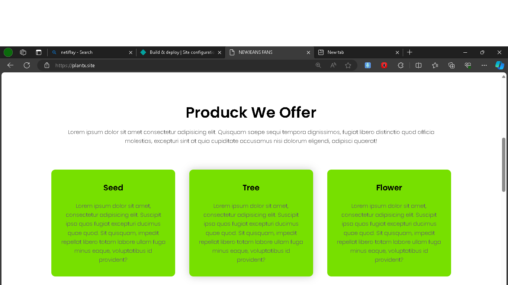
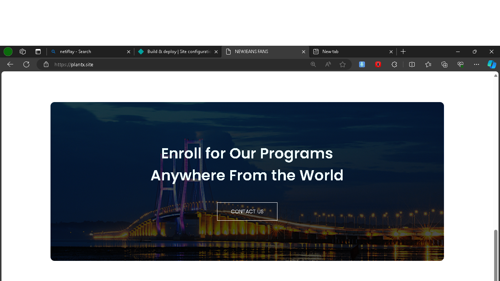

# PLANT X

website ini digunakan untuk berbagai informasi tumbuhan dan jual beli tumbahan

## HTML DESIGN

merupakan halaman utama yang berisikan navigation bar dan logo

merupakan produk seperti seed, flower, dan tree

berufungsi untuk menemukan alamat cabang

menu yang berfungsi untuk mengirimkan link kontak.

tentang perusahaan

## proses Development hosting

pindahkan project ke kolom drag file netifly untuk melakukan upload ke server netify

beli webhosting di niaga hoster

makan akan muncul tampilan seperti di atas, lalu samakan nama server netifly dengan niagahosting

setelah disamakan sesuai dengan netifly dan niaga hosting tahap selanjutnya melakukan setting DNS

pilih record type A
masukan name server plantx.site
untuk value didapat dengan melakukan nslookup untuk mendapatkan alamat IP lalu di masukan ke settingan netifly
lalu pilih save

makan server dan hosting akan melakukan konfirgurasi secara otomatis maksimal 1 hari
setelah itu website dapat di akses pada www.plantx.site

## Build by

css , html , javascript
pembuatan menggunakan bahasa yang semantik & tampilan yang responsif mobile

## author

calvin febriando kurniawan

## alamat website

https://plantx.site/
